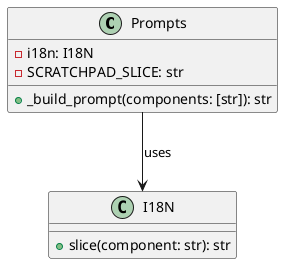
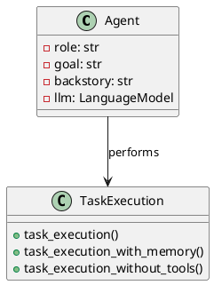

# System Prompt Composition Documentation

## Overview

This documentation aims to provide a clear understanding of how system prompts for agents are composed within our codebase. It will detail the roles of various classes and methods involved in prompt generation and execution, and will include PlantUML diagrams to visualize the logic and relationships.

## Prompt Generation

### The `Prompts` Class

The `Prompts` class is responsible for managing and generating prompts for agents. It supports multiple languages through the use of the `I18N` class for internationalization. The class also defines a `SCRATCHPAD_SLICE` constant, which is appended to prompts to provide a scratchpad area for agents.

#### Attributes and Methods

- `i18n`: An instance of the `I18N` class used for internationalization.
- `SCRATCHPAD_SLICE`: A class variable that holds the string to be appended to prompts for the scratchpad.
- `_build_prompt(components: [str]) -> str`: A method that constructs a prompt string from specified components.

### Prompt Construction

The `_build_prompt` method is a key component in constructing prompts. It takes a list of components, slices internationalized strings for each component, and appends the scratchpad slice to form the final prompt.

### Code Snippet

```python
class Prompts(BaseModel):
    i18n: I18N = Field(default=I18N())
    SCRATCHPAD_SLICE: ClassVar[str] = "\\n{agent_scratchpad}"

    def _build_prompt(self, components: [str]) -> str:
        prompt_parts = [self.i18n.slice(component) for component in components]
        prompt_parts.append(self.SCRATCHPAD_SLICE)
        return PromptTemplate.from_template("".join(prompt_parts))
```

## Task Execution Methods

The `task_execution` method and its variations (`task_execution_with_memory`, `task_execution_without_tools`) generate standard prompts for task execution by calling the `_build_prompt` method with specific components.

## The `Crew` and `Agent` Classes

The `Crew` class manages a group of agents and their task execution process, while the `Agent` class represents an individual agent with specific attributes such as role, goal, backstory, and an optional language model.

### Code Snippet

```python
class Agent(BaseModel):
    role: str
    goal: str
    backstory: str
    llm: Optional[LanguageModel] = None
    # Other attributes...
```

## The `CrewAgentOutputParser` Class

This class parses the output from language model calls and determines the appropriate action or final answer.

## Visualization

Below are PlantUML diagrams that visualize the logic and relationships of the prompt composition process.

### Prompt Generation Process



### Agent and Task Execution



## Conclusion

The documentation provided offers a comprehensive understanding of how system prompts for agents are composed within our system. It includes descriptions of the classes and methods involved, code snippets, and visual diagrams to illustrate the logic and relationships.